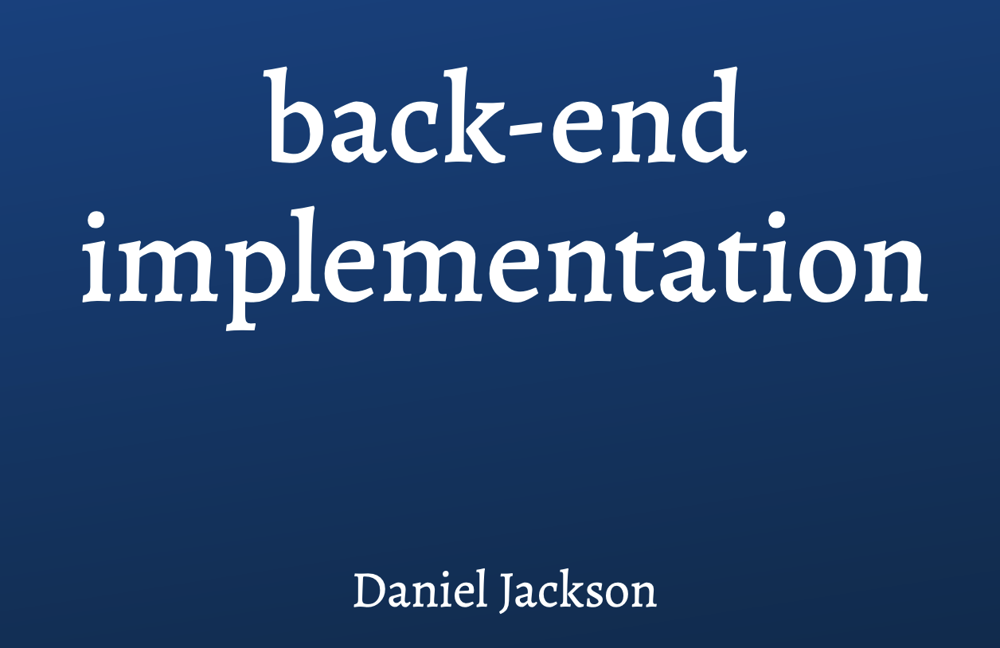
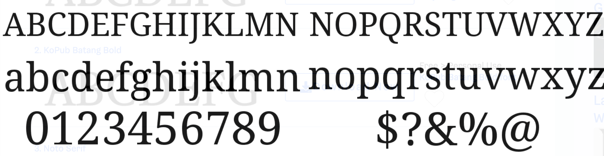
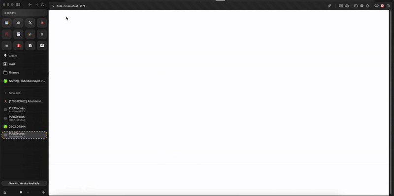

# Visual Design Study

---

## Slide 1 — Typography

Inspiration: “Magma” type from lecture slides.

Chosen: Noto Serif (free, close to Magma) for headings; system sans for UI/body.

Image:

Tokens used (see `index.html`): `--font-serif: 'Noto Serif'`; 
`--font-sans: system-ui`.

---

## Slide 2 — Color

Inspiration: Original arXiv palette; UI style reminiscent of Reddit (“Reddit for arXiv”), since my project is a sort of "reddit for arxiv".

Palette (tokens):

- Brand: `#B31B1B` (hover: `#8E1515`)
- Text: `#111111` · Bg: `#FFFFFF` · Border: `#E5E7EB`
- Sidebar: `#FAFAFA` · Error: `#8B0000` · Info: `#2563EB`

Color inspiration directly from arXiv:

Layout from Reddit:

UI reference:

